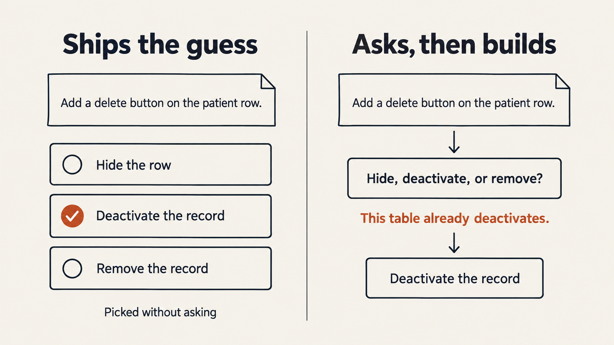
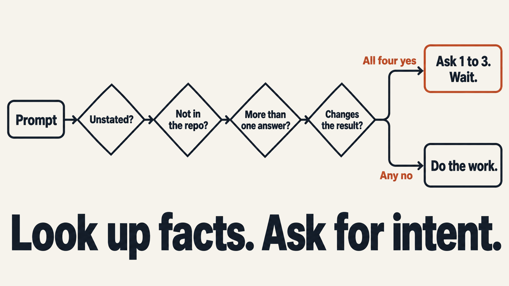

# karpathy-skills-extended

Coding agents fill the blanks in your prompt and ship the guess. "Add a delete button on the patient row" can mean hide the row, mark the record inactive, or remove the record. The agent picks one, writes the code, and opens the PR.

Andrej Karpathy named this habit in his [notes on LLM coding mistakes](https://x.com/karpathy/status/2015883857489522876): models make wrong assumptions on your behalf and run with them. The [Karpathy guidelines](https://github.com/multica-ai/andrej-karpathy-skills) tell the agent to state those assumptions, show tradeoffs, and ask when it is unsure. Agents often write the assumption down and continue. You can see what they assumed. You still did not get a vote before the diff existed.

Matt Pocock's [grill-me](https://github.com/mattpocock/skills/blob/main/skills/productivity/grill-me/SKILL.md) skill, and the [grilling](https://github.com/mattpocock/skills) session under it, walk every branch of the plan and wait until nothing is left assumed. Use that when the idea is still soft. On a prompt that is already a task, the interview runs long.

This skill stays loaded on every prompt. Before it acts, it looks for a fact that would change the result and that it cannot read from the repo, the tools, or the conversation. It asks that, in one round, with the answer it would have used. Three questions is the cap. If nothing passes that test, it does the work and does not mention the check.



## The gap check

All four have to be true before it asks:

1. You did not say it, and no earlier turn settled it.
2. The agent cannot get it from the repo, docs, tools, or config.
3. More than one plausible answer exists.
4. The choice would change the files, behavior, audience, schema, copy, or the check for done.

A fact that fails any line is not a question. The agent looks it up, or follows the reading that matches your request and the surrounding code. Lookup is the agent's job. Your intent is yours.



## Coding rules

The skill keeps the four Karpathy rules, so it still works if you do not install the original:

- **Think before coding.** Name a real tradeoff when it changes the design. Prefer the simpler approach, and say so.
- **Simplicity first.** Code that solves the request. No extra features, no one-off abstraction, no config you did not ask for.
- **Surgical changes.** Edit only the lines the request needs. Match the file. Leave unrelated dead code alone, and say you saw it.
- **Goal-driven execution.** Turn the task into a check you can run, then run it.

On a material gap, the gap check overrides "state the assumption and proceed."

## Install

The behavior file is [`skills/karpathy-skills-extended/SKILL.md`](skills/karpathy-skills-extended/SKILL.md). Copy [`rules/karpathy-skills-extended.md`](rules/karpathy-skills-extended.md) into a rules directory to load it every session. Copy the skill folder to get `/karpathy-skills-extended`.

Grok, every session:

```powershell
New-Item -ItemType Directory -Force "$env:USERPROFILE\.grok\rules" | Out-Null
New-Item -ItemType Directory -Force "$env:USERPROFILE\.grok\skills\karpathy-skills-extended" | Out-Null
Copy-Item "rules\karpathy-skills-extended.md" "$env:USERPROFILE\.grok\rules\karpathy-skills-extended.md"
Copy-Item "skills\karpathy-skills-extended\SKILL.md" "$env:USERPROFILE\.grok\skills\karpathy-skills-extended\SKILL.md"
```

Grok reads `~/.grok/rules/*.md` at the start of every session. The skill description also marks it for model invocation, and you can run it with `/karpathy-skills-extended`.

Cursor, every session: copy [`.cursor/rules/karpathy-skills-extended.mdc`](.cursor/rules/karpathy-skills-extended.mdc) to `~/.cursor/rules/`. The rule sets `alwaysApply: true`.

Claude Code: copy `rules/karpathy-skills-extended.md` to `~/.claude/rules/`, and copy the skill folder to `~/.claude/skills/karpathy-skills-extended/`.

As a plugin:

```bash
grok plugin install anshuxinha/karpathy-skills-extended --trust
```

Plugin install adds the slash command. The rules copy above is what loads the check every session.

## Examples

"Add a delete button on the patient row." Delete might hide the row, mark the record inactive, or remove the record. The agent asks one question, recommends whatever that table already does, and waits.

"Rename getUser to fetchUser in src/api.ts." One reading. The agent renames it.

## License

MIT. The four coding rules follow the structure of [multica-ai/andrej-karpathy-skills](https://github.com/multica-ai/andrej-karpathy-skills). Stopping to ask you, when a decision is still open, follows Matt Pocock's grill-me. The wording in this repo is ours. See [NOTICE](NOTICE).
